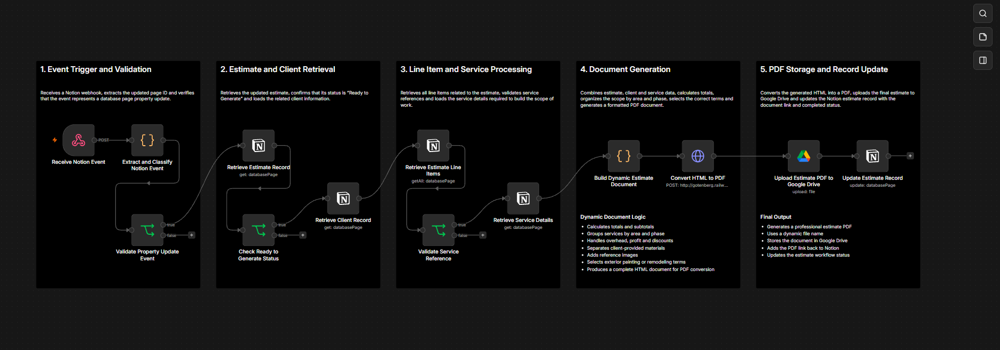

# Automated Estimate Generator

This repository documents an automated estimate PDF generation workflow developed for Allforliz Painting and Renovations.

The system connects Notion, n8n, JavaScript, HTML, Gotenberg and Google Drive to transform structured estimate data into a professional PDF document.



## Project Overview

The company manages clients, estimates, services and estimate line items inside Notion.

When an estimate is ready, its status is changed to:

```text
Ready to Generate
```

This property update triggers the n8n workflow.

The automation then:

1. Receives the Notion event
2. Validates the event type
3. Retrieves the updated estimate
4. Confirms that the estimate is ready
5. Loads the related client
6. Retrieves all estimate line items
7. Retrieves the corresponding service details
8. Builds a dynamic HTML document
9. Converts the HTML into a PDF
10. Uploads the PDF to Google Drive
11. Updates the Notion estimate with the generated document

## Business Problem

Before this workflow, generating a professional estimate required manually transferring information from the internal database into a separate document.

This process created several challenges:

- Repetitive manual work
- Risk of transcription errors
- Inconsistent estimate formatting
- Difficulty organizing services by area and project phase
- Manual total and subtotal calculations
- Manual inclusion of terms and conditions
- Additional time required to create and upload each PDF
- Risk of forgetting to update the estimate record

## Solution

The automated estimate generator uses the structured information already stored in Notion.

When the estimate status changes to `Ready to Generate`, the workflow automatically processes the related information and creates a complete PDF document.

The generated estimate can include:

- Estimate number
- Estimate date
- Client information
- Project address
- Services
- Quantities
- Unit rates
- Subtotals
- Area subtotals
- Phase subtotals
- Overhead and profit
- Discounts
- Client-provided materials
- Reference images
- Terms and conditions
- Warranty information
- Final estimate total

## Workflow Architecture

```text
Notion Estimate Updated
          |
          v
Receive Notion Webhook
          |
          v
Extract and Classify Event
          |
          v
Validate Property Update
          |
          v
Retrieve Estimate Record
          |
          v
Check "Ready to Generate" Status
          |
          v
Retrieve Client Record
          |
          v
Retrieve Estimate Line Items
          |
          v
Validate Service References
          |
          v
Retrieve Service Details
          |
          v
Build Dynamic HTML Document
          |
          v
Convert HTML to PDF
          |
          v
Upload PDF to Google Drive
          |
          v
Update Notion Estimate Record
```

## Workflow Stages

### 1. Event Trigger and Validation

The workflow starts when Notion sends a webhook event.

The first nodes:

- Receive the webhook payload
- Extract the verification token
- Identify the event type
- Extract the updated page ID
- Confirm that the event represents a database page property update

This prevents unrelated Notion events from continuing through the workflow.

### 2. Estimate and Client Retrieval

After the event is validated, the workflow retrieves the updated estimate using the page ID received from Notion.

The system then checks whether the estimate status is exactly:

```text
Ready to Generate
```

If the status matches, the workflow retrieves the related client record.

The client record may provide:

- Client name
- Phone number
- Email address
- Project address
- Requested service

### 3. Line Item and Service Processing

The workflow retrieves all line items related to the estimate from the Estimate Items database.

Each line item may contain:

- Related estimate
- Related service
- Area
- Phase
- Quantity
- Rate
- Rate override
- Subtotal
- Notes

The workflow validates that the line item contains a service reference and a valid quantity before loading the related service details.

The service database may provide:

- Service name
- Default rate
- Standard scope notes
- Category
- Phase
- Related estimate items

### 4. Dynamic Document Generation

The JavaScript node combines data from:

- Estimate record
- Client record
- Estimate line items
- Service records

It then builds a complete HTML document.

The document-generation logic includes:

- Escaping HTML characters
- Handling empty or missing values
- Converting arrays and objects into usable values
- Formatting dates
- Formatting currency
- Calculating subtotals
- Calculating the final total
- Organizing services by area
- Organizing services by phase
- Sorting areas and phases in a defined order
- Separating overhead and profit
- Separating discounts
- Separating non-billable notes
- Adding client-provided materials
- Adding reference images
- Selecting the appropriate terms and conditions
- Preparing the final HTML file for PDF conversion

## Area and Phase Organization

Estimate line items are grouped first by project area and then by work phase.

Example:

```text
Master Bathroom
├── Demolition
├── Plumbing
├── Electrical
├── Waterproofing
├── Tile
├── Painting
└── Final Cleanup
```

This structure makes the final estimate easier for the customer to review.

The workflow also calculates:

- Subtotal for each phase
- Subtotal for each area
- Overhead and profit subtotal
- Discount total
- Final estimate total

## Client-Provided Materials

Items whose phase is configured as:

```text
Notes
```

are treated as client-provided materials or informational items.

These items are excluded from:

- Scope calculations
- Phase subtotals
- Area subtotals
- Overhead and profit
- Discounts
- Final estimate total

Instead, they are displayed in a separate section below the total.

This section informs the customer that:

- The listed items are not included in the estimate total
- The customer is responsible for purchasing them
- The items must be delivered before installation
- Missing or incorrect materials may affect the project schedule
- Additional trips or labor may generate extra charges

## Overhead, Profit and Discounts

The workflow automatically identifies special rows using the item area, phase, service name and notes.

Rows containing terms such as:

```text
overhead
profit
o&p
```

are displayed in a dedicated Overhead & Profit section.

Rows containing:

```text
discount
desconto
```

are displayed in a dedicated Discount section.

This keeps those values separate from the main scope while still including them in the final calculation.

## Dynamic Terms and Conditions

The workflow automatically selects the appropriate terms and conditions based on the estimate content.

### Exterior Painting Terms

Exterior painting terms are selected when the estimate contains exterior painting services and does not contain remodeling-related work.

The terms may include:

- Site preparation
- Pressure washing
- Surface cleaning
- Trenching
- Crack repair
- Caulking
- Primer application
- Paint application
- Touch-ups
- Cleanup
- Exclusions
- Payment terms
- Warranty

### Remodeling Terms

Remodeling terms are selected when the estimate includes services such as:

- Demolition
- Plumbing
- Electrical
- Drywall
- Tile
- Flooring
- Waterproofing
- Cabinets
- Framing
- Bathroom remodeling
- Kitchen remodeling

The remodeling terms include the company's payment structure:

```text
50% deposit to reserve the schedule
40% when the project reaches approximately 90% completion
10% upon final completion
```

The JavaScript logic for grouping, calculations, client materials, dynamic terms, images and HTML generation is implemented inside the `Build Dynamic Estimate Document` node.

## Reference Images

The workflow can include project reference images stored in the estimate record.

If reference images are available, they are added to the PDF in a separate image section.

The images are displayed in a responsive grid and include labels such as:

```text
Reference Image 1
Reference Image 2
```

## PDF Generation

After the HTML document is built, the workflow sends it to a Gotenberg service.

Gotenberg uses Chromium to convert the HTML file into a PDF.

The conversion request is sent through an HTTP POST request using form data.

The generated PDF is returned to n8n as binary file data.

## Google Drive Integration

The generated PDF is uploaded automatically to a dedicated Google Drive folder.

The file name is generated dynamically from the estimate title.

Example:

```text
EST-1024 - Customer Name.pdf
```

This keeps the document organized and connected to the correct estimate.

## Notion Record Update

After the PDF is uploaded, the workflow updates the original Notion estimate.

The final update can include:

- PDF file name
- Google Drive document link
- Generated file reference
- Final workflow status

This closes the automation loop and keeps the estimate record synchronized with the generated document.

## Technologies and Platforms

- Notion
- Notion API
- n8n
- JavaScript
- HTML
- CSS
- JSON
- Webhooks
- HTTP requests
- Gotenberg
- Chromium
- Google Drive
- Google Drive API
- Binary file processing
- Workflow automation
- Data transformation
- Relational database concepts

## Main Technical Challenges

The main technical challenges included:

- Handling Notion webhook events
- Differentiating verification events from property update events
- Retrieving related database records
- Processing one-to-many estimate line items
- Matching line items with service records
- Handling missing or invalid service references
- Managing optional and empty fields
- Applying business rules to totals and subtotals
- Grouping services by area and phase
- Sorting project sections in a logical order
- Separating non-billable notes
- Generating valid HTML dynamically
- Selecting terms based on the estimate type
- Sending binary HTML data to the PDF service
- Uploading the resulting PDF
- Updating the original estimate record
- Preventing private data from being exposed

## Testing

The workflow was tested with different estimate structures.

Testing scenarios included:

- Exterior painting estimates
- Remodeling estimates
- Estimates with multiple areas
- Estimates with multiple phases
- Estimates containing discounts
- Estimates containing overhead and profit
- Estimates with client-provided materials
- Estimates with reference images
- Estimates with missing optional fields
- Estimates with different quantities and rates
- Estimates with rate overrides
- Estimates with empty service references
- Estimates with long scope descriptions

The testing process included:

1. Updating an estimate status to `Ready to Generate`
2. Confirming webhook reception
3. Validating the page ID
4. Retrieving the correct estimate
5. Retrieving the related client
6. Retrieving all line items
7. Confirming service relationships
8. Reviewing calculated totals
9. Reviewing the generated HTML
10. Confirming PDF generation
11. Confirming the Google Drive upload
12. Confirming the Notion record update

## Results

The automated estimate generator contributed to:

- Faster estimate creation
- Reduced manual document preparation
- Consistent document formatting
- More accurate calculations
- Standardized terms and conditions
- Better organization of project scope
- Reduced transcription errors
- Automatic file storage
- Better connection between Notion and Google Drive
- Easier estimate management
- Improved customer-facing documents
- More efficient administrative work

## Repository Structure

```text
automated-estimate-generator/
├── README.md
└── assets/
    └── workflow/
        ├── README.md
        └── automated-estimate-generator-overview.png
```

## Workflow Evidence

The documented workflow overview is available here:

- [Automated Estimate Generator Workflow](assets/workflow/automated-estimate-generator-overview.png)

## Project Status

The initial version of this technical case study is complete.

The repository currently documents:

- Workflow architecture
- Notion event validation
- Estimate and client retrieval
- Line item processing
- Service relationship processing
- Dynamic HTML generation
- Business rules
- PDF conversion
- Google Drive integration
- Notion record updates

## Skills Demonstrated

- Workflow automation
- Webhook handling
- JavaScript development
- HTML and CSS generation
- JSON processing
- Data validation
- Data transformation
- Relational data retrieval
- Business-rule implementation
- Dynamic document generation
- PDF automation
- API integration
- Google Drive integration
- Notion integration
- Error prevention
- Testing and debugging
- Process analysis
- Process improvement
- Technical documentation

## Security and Privacy

This repository does not include:

- Production webhook URLs
- Internal service URLs
- Notion database IDs
- Notion page IDs
- API keys
- Access tokens
- Google Drive folder IDs
- Customer names
- Customer phone numbers
- Customer email addresses
- Project addresses
- Real estimate documents
- Private company records
- Unredacted workflow exports

All examples and screenshots use public, fictional, anonymized or redacted information.

## Disclaimer

This repository is a technical case study based on a real business automation project.

Sensitive data, credentials, private URLs and customer information have been removed.

The workflow was created to support the internal estimate process of Allforliz Painting and Renovations.
